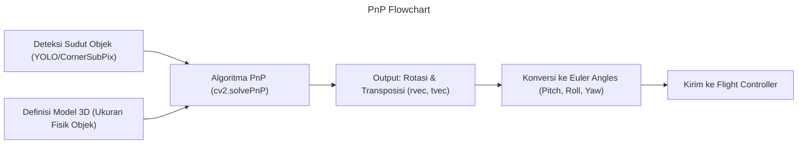

<!-- markdownlint-disable MD060 -->

# Modul Computer Vision Lanjutan

## Daftar Isi

### Teori

- [Dasar](#dasar)
- [Data dan Sensor](#data-dan-sensor)
- [Preprocessing](#preprocessing)
- [Inference](#inference)
- [Postprocessing](#postprocessing)
- [Transformasi Koordinat 2D ke 3D](#transformasi-koordinat-2d-ke-3d)

### Implementasi

- [OpenCV](#opencv)
- [Roboflow](#roboflow)
- [Yolo](#yolo)
- [Alat Inference](#alat-inference)
- [Website Penting](#website-penting)
- [Belajar Lebih Lanjut](#belajar-lebih-lanjut)

## [Dasar](#dasar)

Section ini membahas penerapan computer vision pada Unmanned Aerial Vehicles (UAV) atau UAV. Fokus utama adalah pada teknik pengolahan citra dan visi yang digunakan untuk berbagai aplikasi UAV, seperti pemetaan, pengawasan, dan inspeksi.

### Garis Besar


### UAV Computer Vision

Computer vision pada UAV itu real-time dan terbatas sumber daya

#### Tabel Perbadingan Computer Vision Biasa dan UAV Computer Vision

| Aspek | CV Biasa | CV UAV |
|-------|----------|--------|
| Sumber Daya | Tak Terbatas | Fixed dan Terbatas Sumber Daya |
| Daya Listrik | Tak Terbatas | Terbatas Baterai |
| Latensi | Tidak Terbatas | Real-time / Low Latency |
| Kegagalan | Bisa Restart | Harus Tahan Gagal atau Crash |
| Lingkungan | Terkontrol | Dinamis dan Tidak Terduga |
| Kamera | Statis | Bergerak / Dinamis |

Contoh: Model yolo yang memiliki akurasi 95% tetapi sering miss frame lebih buruk daripada model dengan akurasi 80% tetapi stabil di fps yg sama. Biasanya ada tradeoff antara akurasi dan kecepatan.

### Fungsi dan Peran Computer Vision pada UAV

#### Fungsi Umum untuk UAV

- Object Detection (Orang, Kendaraan, Bangunan, Api)
- Visual Tracking
- Obstacle Avoidance
- Mapping

#### Peran Computer Vision pada UAV

- Manual: Kesadaran Operator
- Assisted: Peringatan dan pemberian informasi
- Autonomus: Kontrol penuh UAV dan pengambil keputusan

Visi tidak menerbangkan UAV, tetapi visi memberikan informasi kepada pengendali UAV atau sistem otonom untuk membuat keputusan.

### End to End Pipeline Computer Vision pada UAV


### Batasan Hardware UAV

#### Compute Platforms

- Embedded Systems: NVIDIA Jetson, Google Coral, Raspberry Pi
- Custom Hardware: FPGA, ASIC

#### Batasan yang Perlu Diperhatikan

- Komputasi Terbatas: Pilih model ringan
- Daya Terbatas: Optimalkan konsumsi daya
- Penyimpanan Memory Terbatas: Gunakan model kompresi / quantized
- Thermal Throttling

Pertanyaan penting: Bisakah ini dijalankan 20 menit dibawah sinar matahari tanpa overheat dan menguras baterai?

### Latency vs Accuracy Tradeoff

Kompromi inti UAV

Kita tidak bisa memaksimalkan semuanya

```text
Accuracy naik -> Latency naik -> Control Delay naik -> Safety turun
Latency turun -> Resolusi turun -> Accuracy turun -> Control Delay turun -> Safety naik
```

#### Contoh nyata

- 640x640 @ 30 FPS -> Flyable
- 1280x1280 @ 8 FPS -> Bahaya

Belajar budgeting, bukan mengejar angka dan metrik

### Karakteristik sensor yang berpengaruh terhadap Visi

#### Faktor Kamera

- Resolusi: Lebih tinggi lebih baik, tapi butuh komputasi lebih
- Frame Rate: Lebih tinggi lebih baik untuk tracking dan obstacle avoidance
- Shutter Type: Global shutter sangat direkomendasikan untuk UAV agresif atau presisi tinggi. Rolling shutter masih dapat digunakan dengan mitigasi yang tepat.
- Motion Blur: Gunakan exposure time pendek untuk mengurangi blur
- Exposure Time vs FPS: Jika ingin FPS tinggi, exposure time harus pendek. Tetapi semakin pendek exposure time, semakin gelap gambarnya
- FOV vs Detection scale: Semakin lebar FOV, semakin kecil objek di gambar, tetapi cakupan area lebih besar

#### Faktor Lingkungan

- Pencahayaan: Kondisi cahaya berubah-ubah
- Sudut Matahari: Lens Flare
- Bayangan
- Debu, kabut, hujan
- Background Clutter

### Detection vs Tracking vs Segmentation

#### Object Detection (Deteksi Objek)

Deteksi adalah tahap paling dasar di mana CV mencoba menjawab pertanyaan: "Apa objek itu dan di mana lokasinya?"

- Cara Kerja: CV akan mengidentifikasi kategori objek (misal: orang, mobil) dan menggambar kotak pembatas yang disebut Bounding Box di sekitar objek tersebut.
- Output: Koordinat kotak (x, y, w, h) dan label kelas beserta skor keyakinannya (confidence score).
- Kegunaan: Sangat cepat dan efisien untuk menghitung jumlah objek dalam satu gambar statis.

#### Object Tracking (Pelacakan Objek)

Pelacakan melangkah lebih jauh dari deteksi dengan menjawab pertanyaan: "Ke mana objek itu pergi?"

- Cara Kerja: Setelah objek dideteksi pada satu frame video, algoritma pelacakan akan memberikan ID unik pada objek tersebut. Algoritma ini kemudian mencoba mencocokkan objek yang sama pada frame-frame berikutnya.
- Pentingnya: Tanpa tracking, CV hanya melihat sekumpulan deteksi yang terputus-putus. Dengan tracking, CV tahu bahwa "Mobil A" di detik ke-1 adalah "Mobil A" yang sama di detik ke-5, meskipun posisinya berpindah.Kegunaan: Menghitung arus lalu lintas, mengikuti pergerakan pemain bola, atau memantau jalur terbang UAV.

#### Image Segmentation (Segmentasi Gambar)

Segmentasi adalah teknik yang paling mendetail karena bekerja pada level pixel. Ia menjawab: "Manakah bagian (pixel) yang merupakan bagian dari objek ini?"

Terdapat dua jenis utama:

- Semantic Segmentation: Mengelompokkan semua pixel dengan kategori yang sama. Misalnya, semua pixel "jalan" diberi warna merah, dan semua "trotoar" diberi warna biru.
- Instance Segmentation: Tidak hanya membedakan kategori, tapi juga membedakan tiap individu objek. Misalnya, jika ada tiga orang, masing-masing orang akan memiliki "masker" warna yang berbeda (misal: merah, hijau, kuning).
- Kegunaan: Mobil otonom (untuk mengetahui batas jalan yang presisi), diagnosis medis (mengukur luas tumor), dan penentuan area pendaratan UAV.

#### Perbandingan Ringkas

| Fitur | Detection | Tracking | Segmentation |
|-------|-----------|----------|--------------|
| Output Utama | Kotak (Bounding Box) | ID Unik + Jalur Gerak | Masker (pixel demi pixel) |
| Fokus Utama | Keberadaan Objek | Kontinuitas Gerakan | Bentuk & Batas Presisi |
| Beban Komputasi | Sedang | Ringan (setelah deteksi) | Berat |

### Kegagalan Umum pada UAV CV

- Manuver: Saat UAV belok tajam, CV sering "buta" karena blur.
- Ketinggian: Makin tinggi UAV, makin banyak deteksi palsu (false positive).
- Cahaya: Fajar/senja membuat CV gagal mengenali target karena minim kontras.
- Panas: CV bisa kepanasan (overheat), membuat kecepatan deteksi (FPS) anjlok drastis.
- Cuaca: Hujan, kabut, debu mengurangi kualitas gambar.
- Kamera: Lensa kotor, goyang, atau salah kalibrasi.

### Peran Sistem dan Batasan

- Vision System: Sees, interprets, reports confidence
- Flight Controller: Decides, acts, stabilizes

## [Data dan Sensor](#data-dan-sensor)

Tujuan: Mengontrol, memahami, dan mempersiapkan data visi di sumbernya sebelum pra-pemrosesan, sebelum model.

### Fungsi Layer Data dan Sensor

Ide Utama: Setiap kegagalan CV pada UAV biasanya berawal dari data/sensor yang buruk.

Section ini membahas:

- Apa yang dilihat kamera?
- Apa pengaruh motion terhadap gambar?
- Bagaimana bisa raw frames menjadi gambar yang bisa diproses CV?

### Fundamental Kamera UAV

#### Cara Kerja Kamera

Kamera mengubah cahaya menjadi sinyal listrik melalui sensor gambar (image sensor) yang terdiri dari jutaan fotodioda kecil (pixel). Setiap pixel mengukur intensitas cahaya yang jatuh padanya dan mengubahnya menjadi nilai digital. Sensor gambar utama adalah CCD (Charge-Coupled Device) dan CMOS (Complementary Metal-Oxide-Semiconductor).

#### Tipe Kamera yang digunakan di UAV

- RGB (Paling umum)
- Thermal
- Multispectral (Kamera yang bisa menangkap beberapa spektrum cahaya tidak cuma visible light)
- Depth Camera (Untuk mengukur jarak objek)
- Night Vision Camera (Biasanya kegunaan militer)

Fokus section ini adalah kamera RGB biasa.

#### Mekanisme Shutter Kamera

| Tipe | Cara Kerja | Dampak pada UAV |
|------|------------|-----------------|
| Global Shutter | Menangkap seluruh pixel secara serentak | Sangat Baik: Objek tetap tajam meski UAV bergerak sangat cepat atau bergetar |
| Rolling Shutter | Menangkap gambar baris demi baris (atas ke bawah) | Buruk: Muncul efek miring (skew), goyang (wobble), atau efek jello pada video |

##### Mengapa Data Training Harus Sesuai dengan Tipe Shutter?

Jika kalian menggunakan model CV di lapangan dengan kamera Rolling Shutter, namun melatihnya (training) hanya dengan gambar sempurna dari internet (yang biasanya Global Shutter atau foto statis), maka:

- Model Tidak Siap: CV tidak pernah "belajar" mengenali objek yang miring atau terdistorsi.
- Akurasi Rendah: Di lingkungan nyata, akurasi akan terjun bebas karena ada perbedaan visual yang signifikan antara data latihan dan input kamera UAV.
- Solusi: Jika terpaksa menggunakan kamera murah, kalian harus menambahkan augmentasi data berupa geometric distortion atau motion blur pada saat training agar CV lebih "kebal" terhadap efek rolling shutter.

#### Lensa dan Field of View (FOV)

| Tipe FOV | Kelebihan | Kekurangan |
| -------- | --------- | ---------- |
| Narrow (Sempit) | Detail sangat tinggi, objek terlihat besar | Area cakupan kecil, sulit mencari target yang hilang |
| Wide (Lebar) | Area cakupan luas, navigasi lebih mudah | Objek terlihat sangat kecil, banyak distorsi di pinggir lensa |

##### Hubungan Pixel-to-Meter (Resolusi Spasial)

Dalam Computer Vision, kita harus memahami berapa banyak area di dunia nyata yang diwakili oleh satu pixel di layar (GSD - Ground Sample Distance).

- Logikanya: Jika kamera Anda memiliki resolusi 1080p dan menggunakan lensa Wide, satu pixel mungkin mewakili 10 cm di tanah. Jika menggunakan lensa Narrow, satu pixel mungkin hanya mewakili 2 cm.
- Dampak pada CV: Algoritma deteksi membutuhkan jumlah pixel minimal (misal: 20x20 pixel) untuk mengenali sebuah objek. Jika nilai pixel-to-meter terlalu besar (satu pixel mencakup area yang luas), objek kecil seperti manusia hanya akan terlihat seperti satu titik kecil yang mustahil dideteksi.

##### Perubahan Ukuran Objek terhadap Ketinggian

Ukuran objek pada gambar tidaklah statis, ia berubah secara berbanding terbalik dengan ketinggian UAV.

- Fenomena: Jika UAV naik dua kali lebih tinggi, ukuran objek di layar akan mengecil menjadi seperempatnya (secara area).
- Masalah Deteksi: Model CV yang dilatih pada ketinggian 10 meter mungkin akan gagal total saat UAV terbang di ketinggian 50 meter karena fitur-fitur visual objek tersebut menjadi terlalu kecil untuk dikenali oleh convolutional layers pada model.

### Image Signal Path (Sensor to Image)


Tuning ISP bisa mempengaruhi akurasi kepada CV lebih daripada hyperparameter model itu sendiri.

### Format Umum Gambar

- RAW: Data mentah dari sensor, belum diproses
- YUV: Format kamera umum, memisahkan luminance (Y) dan chrominance (U,V)
- HSV: Warna berdasarkan Hue, Saturation, Value
- RGB: Format umum untuk CV, tiga channel warna (Red, Green, Blue)
- BGR: Format default OpenCV, tiga channel warna (Blue, Green, Red)
- Grayscale: Satu channel intensitas cahaya, mengurangi kompleksitas komputasi
- JPEG/PNG: Tidak ideal untuk CV low-level atau geometric vision, tapi sangat umum dan cukup untuk detection berbasis CNN

Penting: Kebanyakan bug pada CV datang dari ketidaksesuaian BGR vs RGB

Berikut adalah ringkasan untuk poin 1.5 hingga 1.7 dalam konteks Computer Vision untuk UAV (UAV):

### Frame Timing & Synchronization

Sinkronisasi waktu adalah kunci agar UAV tidak "bingung" dengan datanya sendiri.

- FPS vs Exposure: FPS tinggi butuh cahaya banyak. Jika gelap, exposure lama akan menurunkan FPS asli.
- Dropped Frames: Frame yang hilang karena kabel longgar atau CPU sibuk. CV harus bisa menangani jeda waktu ini.
- UAV Issues:
  - Camera FPS =! Inference FPS: Kamera kirim 60 gambar/detik, tapi CV mungkin hanya sanggup proses 15 gambar/detik.
  - Sync IMU & Image: Data kemiringan UAV (IMU) harus pas dengan gambar. Jika telat 0.1 detik saja, estimasi posisi bisa meleset jauh.

Penting: Data gambar tanpa catatan waktu yang akurat tidak berguna untuk navigasi otonom.

### Motion Artifacts & Environmental Effects

#### Masalah Gerak

- Motion Blur: Kabur karena gerak cepat.
- Rolling Shutter Skew: Objek terlihat miring saat UAV bermanuver.
- Jitter: Getaran halus dari motor UAV yang merusak detail pixel.

#### Masalah Lingkungan

- Sun Glare: Pantulan cahaya matahari langsung ke lensa.
- Shadows: Bayangan tajam yang sering dianggap objek oleh AI.
- Haze/Dust: Debu atau kabut yang menurunkan kontras.

Penting: Expect imperfect data. Jangan berharap gambar sejelas foto studio. Data di lapangan akan selalu berantakan.

### Dataset Design for UAV Vision

Jangan hanya mengumpulkan gambar, tapi rancanglah sebuah sistem data.

#### Dataset Sources

- Real Flight Footage: Data terbaik karena asli, tapi mahal dan berisiko jatuh.
- Ground-based Simulation: Mengambil gambar dari darat dengan sudut pandang UAV (misal dari balkon) untuk menghemat biaya.
- Synthetic Data: Menggunakan game engine (Unity/Unreal) untuk membuat ribuan gambar secara otomatis.

#### Dataset Diversity Axes (Sumbu Keberagaman)

Dataset yang bagus harus memiliki variasi pada:

- Altitude: Objek harus difoto dari berbagai ketinggian.
- Camera Angle: Sudut tegak lurus vs sudut miring .
- Time of Day: Pagi, siang, dan sore (perubahan bayangan).
- Weather: Cerah, berawan, hingga berkabut.

Penting: Dataset != folder of images. Dataset adalah representasi terukur dari semua kondisi yang mungkin ditemui UAV di dunia nyata.

### Sumber Dataset UAV Terbuka

- Roboflow Universe: [universe.roboflow.com](universe.roboflow.com)
- Kaggle Datasets: [www.kaggle.com/datasets](www.kaggle.com/datasets)
- Mendeley Data: [data.mendeley.com](data.mendeley.com)
- Google Dataset Search: [datasetsearch.research.google.com](datasetsearch.research.google.com)
- Hugging Face: [huggingface.co/datasets](huggingface.co/datasets)
- VisUAV: [github.com/VisUAV/VisUAV-Dataset](github.com/VisUAV/VisUAV-Dataset)

### Tools untuk Membuat Dataset (Labelling)

- Roboflow Annotate: [roboflow.com/annotate](roboflow.com/annotate)
- Label Studio: [https://labelstud.io/)](https://labelstud.io/)
- CVAT: [github.com/openvinotoolkit/cvat](github.com/openvinotoolkit/cvat)
- LabelMe: [github.com/wkentaro/labelme](github.com/wkentaro/labelme)

### Struktur Dataset Yolo

#### Directory Layout

```text
dataset/
├── images/
│   ├── train/
│   ├── val/
│   └── test/
└── labels/
    ├── train/
    ├── val/
    └── test/
```

#### Label Format

Setiap baris dalam file label mewakili satu objek dengan format:

```text
<class_id> <x_center> <y_center> <width> <height>
```

#### Normalisasi

Disini kita membahas tentang normalisasi koordinat bounding box pada format label Yolo.

##### Apa itu Normalisasi?

Normalisasi adalah proses mengubah koordinat pixel (misal: 0-1920) menjadi rentang 0.0 sampai 1.0.

##### Mengapa ini dilakukan?

Agar label tetap akurat meskipun Anda mengubah ukuran gambar (resizing). Jika Anda melatih model dengan gambar 1080p lalu melakukan inferensi pada gambar 720p, koordinat absolut akan berantakan, tetapi koordinat normalisasi tetap tepat di tengah objek.

##### Cara Menghitung Normalisasi

Misalkan Anda punya gambar dengan resolusi 1000 x 1000 pixel dan sebuah kotak deteksi (bounding box).

| Komponen | Rumus | Contoh Perhitungan | Hasil (YOLO) |
|----------|-------|--------------------|--------------|
| x_center | x_pusat_pixel / lebar_gambar | 500 / 1000 | 0.5 |
| y_center | y_pusat_pixel / tinggi_gambar | 500 / 1000 | 0.5 |
| width | lebar_kotak_pixel / lebar_gambar | 200 / 1000 | 0.2 |
| height | tinggi_kotak_pixel / tinggi_gambar | 300 / 1000 | 0.3 |

### Labeling for UAV Use Cases

Melabeli data UAV berbeda dengan foto biasa karena sudut pandang dari atas.

#### Aturan Spesifik

- Ukuran Minimum: Jangan labeli objek yang terlalu kecil (misal < 10 pixel) karena CV hanya akan belajar dari noise.
- Occlusion (Terhalang): Tetap gambar kotak jika Anda tahu objek ada di sana (misal orang di bawah pohon), asalkan masih terlihat sebagian.

#### Kesalahan Umum

- Over-tight Boxes: Kotak terlalu mepet sehingga memotong fitur penting objek.
- Labeling Motion Blur: Jangan melabeli bayangan kabur sebagai objek jika bentuk aslinya sudah tidak dikenali.
- Inconsistent Class: Sekarang disebut "daun_sakit", besok "daun_bercak". Ini merusak logika AI.

Penting: Consistency > Precision. Lebih baik semua label sedikit meleset tapi seragam, daripada sangat akurat tapi tidak konsisten.

## [Preprocessing](#preprocessing)

Tujuan: Mengonversi frame kamera mentah menjadi tensor yang siap digunakan untuk model dengan cepat, akurat, dan deterministik.

### Peran preprocessing pada CV UAV

Ide Utama: Preprocessing adalah bagian dari pipeline real-time, bukan sekedar tahapan bantuan.

Preprocessing yang buruk menyebabkan:

- Latency Tinggi dan Spikes: Jika preprocessing lambat, keseluruhan sistem CV akan melambat.
- Distorsi Data: Transformasi yang salah bisa merusak fitur penting pada gambar.
- Ketidakstabilan Inferensi: Frame rate yang tidak konsisten membuat kontrol UAV goyah.
- False Detections: Data yang tidak tepat menyebabkan model salah mengenali objek.

### Ringkasan Tahapan Preprocessing


- Camera Frame Capture: Dapatkan frame mentah dari kamera.
- Format Conversion: Ubah warna dari BGR ke RGB agar CV tidak salah mengenali warna objek.
- Resize / Letterbox: Sesuaikan ukuran gambar ke input model tanpa merusak rasio aslinya.
- Normalize: Ubah nilai pixel 0-255 menjadi 0.0-1.0 agar perhitungan matematika CV lebih stabil.
- Layout Transform: Susun ulang urutan data dari (H, W, C) menjadi (C, H, W) sesuai standar GPU / CPU.
- Tensor Upload: Kirim data akhir ke memori GPU atau NPU untuk diproses oleh model.

### Strategi Input Resolusi

#### Fixed Resolution

- Fixed Resolution: Semua frame diubah ke ukuran tetap (misal: 640x480). Lebih mudah dioptimalkan, tapi bisa kehilangan detail pada objek kecil.

Penting: Di UAV, kita diharuskan menggunakan fixed resolution untuk kestabilan dan prediktabilitas.

#### Typical UAV Choices

- Common Size: 640x640
- Trade-offs: Resolusi lebih tinggi = akurasi lebih baik, tapi butuh komputasi lebih banyak dan latency lebih tinggi.

### Resize vs Letterbox

#### Resize

- Keunggulan: simpel, cepat
- Kekurangan: distorsi objek

#### Letterbox

- Keunggulan: mempertahankan rasio aspek
- Kekurangan: padding, kompleksitas scaling

#### Realitas UAV

- Lebih disukai menggunakan letterbox untuk deteksi
- Harus melacak offset padding untuk pemrosesan selanjutnya

### Color Space Handling

- Common Conversions: Proses mengubah cara warna direpresentasikan, seperti dari format transmisi video ke format tampilan atau pemrosesan AI.
- Contoh: YUV (sinyal video) -> RGB (warna standar) -> BGR (format default OpenCV).
- Model Expects RGB: Hampir semua model deteksi (YOLO) dilatih dengan data RGB, sehingga input harus disesuaikan.
- GPU vs CPU Conversion Cost: Melakukan konversi warna di CPU bisa menyebabkan bottleneck, sehingga lebih baik dilakukan langsung di GPU/NPU menggunakan hardware accelerator.

### Teknik Normalisasi dan Quantization

- Scale Pixel Values [0,1]: Mengubah angka pixel 0-255 menjadi 0.0-1.0 agar input model lebih seragam.
- Mean/Std Scaling: Menyelaraskan distribusi warna gambar dengan data yang digunakan saat training model.
- FP32 vs FP16 vs INT8: FP32 paling akurat, tapi INT8 jauh lebih cepat dan hemat memori pada perangkat edge.

### Batch Size dan Stream Handling

- Batch Size = 1: Pada UAV, kita memproses gambar satu per satu segera setelah ditangkap untuk meminimalkan jeda waktu.
- Mengapa batching mersuak latency: Batching meningkatkan throughput (jumlah total gambar per detik), tapi merusak latency (waktu respon per gambar).

### Determinism dan Timing Guarantees

- Variable Preprocessing Time: Waktu proses yang berubah-ubah (misal karena CPU panas) bisa mengacaukan kontrol UAV.
- Frame Queue Buildup: Antrean gambar yang menumpuk karena CV lebih lambat dari kamera, menyebabkan deteksi "terlambat" dari posisi UAV aslinya.
- Frame Drop Policy: Kebijakan untuk membuang frame lama jika CV masih sibuk, agar CV selalu memproses gambar terbaru (fresh).

Penting: Deterministic > fast. Sistem yang sedikit lebih lambat tapi stabil waktunya jauh lebih aman daripada sistem yang sangat cepat tapi sering tersendat.

### Calibration-Aware Preprocessing

- Undistortion Before Resize: Melakukan koreksi distorsi lensa (efek fisheye) pada resolusi asli sebelum gambar diperkecil.
  - Contoh: Menghilangkan kelengkungan garis cakrawala agar objek di pinggir foto tidak terlihat melengkung.
- Fixed Camera Matrix Usage: Menggunakan parameter intrinsik kamera (focal length, optical center) yang sudah dihitung secara permanen.
  - Contoh: Memasukkan file .yaml hasil kalibrasi kamera spesifik UAV Anda ke dalam kode OpenCV.

Penting: Koreksi di awal. Jika distorsi tidak dibuang, CV akan kesulitan mendeteksi objek di area pinggir lensa karena bentuknya yang melengkung tidak wajar.

### Geometry-Safe Resizing

- Aspect Ratio Preservation: Menjaga perbandingan lebar dan tinggi gambar agar objek tidak terlihat "gepeng".
  - Contoh: Menggunakan teknik Letterboxing (menambah bar hitam) alih-alih menarik gambar secara paksa ke ukuran 640x640.
- Pixel Mapping Correctness: Memastikan setiap pixel pada gambar hasil resize tetap memetakan koordinat yang benar di dunia nyata.
  - Contoh: Menggunakan interpolasi INTER_LINEAR atau INTER_AREA di OpenCV yang sesuai dengan tipe objek yang dideteksi.

### Preprocessing untuk Training vs Inference

- Training-only (Augmentation): Menggunakan teknik acak agar model belajar dari berbagai kondisi sulit.
- Inference-only (Deterministic): Proses harus baku dan tidak boleh ada elemen acak agar hasil deteksi konsisten.

### Contoh kesalahan dalam Preprocessing

- Wrong Aspect Ratio: Gambar yang "ketarik" membuat objek bulat jadi lonjong, sehingga CV gagal mengenali bentuknya.
- Wrong Normalization: Lupa membagi 255 atau salah nilai mean/std membuat skor keyakinan (confidence) CV anjlok drastis.
- Incorrect Padding Handling: Kesalahan saat menambah border hitam membuat kotak deteksi (bounding box) bergeser dari objek aslinya.

## [Inference](#inference)

Tujuan: Lakukan inferensi neural secara terprediksi, aman, dan cukup cepat untuk penerbangan, menggunakan output preprocessing.

Section ini membahas:

- Kapan inference jalan
- Seberapa sering inference jalan
- Bagaimana inference terintegrasi dalam sistem UAV

### Peran Inference pada UAV CV

#### Garis Besar Peletakan Inference dalam Sistem UAV


Inference adalah:

- Tugas real-time: Harus selesai dalam batas waktu tertentu agar UAV bisa bereaksi cepat.
- Pesaing sumber daya (CPU/GPU/NPU)
- Penyumbang latensi

### Model Pengaturan Waktu Inferensi

#### Model umum

- Frame-synchronous (every frame)
- Fixed rate (contoh 10 Hz)
- Event-driven (triggered)

#### Realitas UAV untuk Inferensi

- Deteksi seringkali berjalan lebih lambat daripada FPS kamera
- Frame dilewati dengan sengaja

Penting: Melewatkan frame adalah fitur, bukan bug.

### Inference Frequency & Control Loop Impact

Di dunia UAV, CV tidak berdiri sendiri. Ia adalah "mata" yang membimbing "tangan" (sistem kendali/flight controller).

- Control-Loop Coupling: Sistem kontrol UAV bekerja sangat cepat. Jika CV memberikan data terlalu lambat, perintah gerak UAV akan menjadi tidak sinkron.
  - Vision Latency memengaruhi stabilitas kontrol: Semakin lama CV memproses gambar (latency), semakin tidak stabil gerakan UAV. UAV akan mulai goyang (oscillate) karena ia bereaksi terhadap posisi objek yang sudah lewat.
  - Inference lambat -> Deteksi basi

- Konsep Penting yang Harus Dipahami:
  - Time-to-useful-detection: Waktu total yang dibutuhkan mulai dari sensor menangkap cahaya sampai sistem kendali menerima instruksi. Nilai ini tergantung dinamika UAV dan jenis misi.
  - Detection Freshness: Seberapa "segar" data deteksi tersebut. Data yang segar adalah data yang diambil kurang dari beberapa milidetik yang lalu.

Penting: Tingkat inferensi harus sesuai dengan kebutuhan misi.

### Standar I/O

#### Input

Input ke model harus bersifat "Immutable" (tidak boleh berubah strukturnya):

- Fixed-shape tensor: Jika model dilatih untuk 640x640, input harus selalu 640x640. Jangan pernah membiarkan dimensi berubah di tengah jalan.
- Known layout: Pastikan formatnya sudah pasti.
- Timestamped: Setiap data yang masuk harus membawa catatan waktu kapan gambar tersebut diambil oleh kamera, bukan kapan ia sampai di CV.

#### Output

Output dari model hanyalah angka mentah (Raw Prediction). Jangan langsung membuat keputusan gerak di sini. Biarkan modul lain yang menerjemahkan angka ini menjadi koordinat atau perintah terbang.

### Latency Budgeting

Dalam UAV, kita bekerja dengan "Hard Deadlines". Jika UAV terbang 5 m/s, keterlambatan 100ms berarti UAV sudah berpindah 50cm sebelum ia sadar ada rintangan.

| Tahapan | Anggaran Maksimal (Contoh) | Deskripsi |
| ------- | -------------------------- | --------- |
| Preprocessing | 8 ms | Resize, Normalize, Upload ke GPU |
| Inference | 20 ms | Waktu CV "berpikir" (Running model) |
| Postprocessing | 5 ms | Non Maximum Suppression, koordinat transform |
| TOTAL | 33 ms | Setara dengan 30 FPS |

### Model Optimization Techniques

- Pruning: Menghapus neuron yang tidak penting untuk mempercepat inferensi.
- Quantization: Mengurangi presisi angka (misal dari FP32 ke INT8) untuk mempercepat komputasi.
- Knowledge Distillation: Melatih model kecil (student) untuk meniru model besar (teacher) agar tetap akurat namun lebih ringan.
- Hardware Acceleration: Memanfaatkan GPU, NPU, atau TPU untuk mempercepat inferensi.

### Integrasi dengan Postprocessing

#### Peran Inference vs. Postprocessing

| Karakteristik | Inference Engine | Postprocessing |
| ------------- | ---------------- | -------------- |
| Output | Raw Tensor (skor numerik) | Objek Terstruktur (Koordinat, Kelas, ID) |
| Konteks | Hanya tahu pixel gambar | Tahu koordinat GPS, tinggi UAV, & waktu |
| Tujuan | Klasifikasi & Lokalisasi mentah | Pengambilan keputusan & Filter data |

#### Mengapa Postprocessing Diperlukan?

- Interpretasi Data: Model hanya mengeluarkan angka (misal: 0.85). Postprocessing mengubahnya menjadi informasi bermakna
- Penyaringan (Filtering): Model sering mengeluarkan ribuan kotak prediksi yang tumpang tindih. Postprocessing menggunakan algoritma seperti Non-Maximum Suppression (NMS) untuk memilih satu kotak terbaik.
- Transformasi Koordinat: Mengubah posisi objek dari sistem koordinat gambar (pixel) ke sistem koordinat dunia nyata (Latitude/Longitude) berdasarkan sensor IMU UAV.
- Temporal Consistency: Memastikan bahwa objek yang terdeteksi di frame ke-1 adalah objek yang sama di frame ke-2 agar tidak terjadi lonjakan data (flickering).

#### Struktur Data Inference

- Bounding Box Array: $[x, y, w, h]$ dalam format normalisasi.
- Confidence Scores: Nilai probabilitas $[0.0 - 1.0]$.
- Class Indices: ID kategori objek $[0, 1, 2, ...]$.
- Metadata: Timestamp sinkronisasi dan ID kamera.

## [Postprocessing](#postprocessing)

Tujuan: Mengubah output mentah dari model menjadi informasi bermakna yang dapat digunakan untuk pengambilan keputusan UAV secara real-time.

Modul ini menjawab pertanyaan-pertanyaan berikut:

- Apa arti tensor-tensor ini?
- Deteksi mana yang harus kita percayai?
- Bagaimana deteksi bertahan seiring waktu?
- Bagaimana CV memengaruhi keputusan UAV?

### Peran Postprocessing pada UAV CV

#### Garis Besar Peletakan Postprocessing dalam Sistem UAV


Penting: Output mentah YOLO sangat berantakan. seringkali terdapat ratusan kotak untuk satu objek yang sama.

### Interpretasi Output Mentah Model

Sebelum menyaring data, kita harus mengerti apa yang dikeluarkan oleh model:

- Bounding Boxes: Koordinat lokasi objek (biasanya $[x, y, w, h]$).
- Confidence Scores: Seberapa yakin CV bahwa ada "sesuatu" di kotak tersebut.
- Class Probabilities: Seberapa yakin CV bahwa "sesuatu" itu adalah objek spesifik (misal: Orang).

Website untuk visualisasi input output mentah (file ONNX):

- Netron: [netron.app](https://netron.app/)

### Confidence Thresholding

Tujuan: Buang semua "sampah" deteksi berkualitas rendah.

- Global vs Class-specific: Kadang kita butuh standar berbeda untuk tiap objek.
- Contoh UAV:
  - Search & Rescue (Manusia): Gunakan threshold rendah (misal 0.3) agar tidak melewatkan korban, meski banyak deteksi palsu.
  - Pendaratan Otonom (Heliport): Gunakan threshold tinggi (0.8) karena kita butuh kepastian mutlak sebelum mendarat.

### Non-Maximum Suppression (NMS)

Tujuan: Hapus deteksi yang tumpang tindih untuk satu objek yang sama.

- Duplicate Detections: Model sering mendeteksi bagian-bagian berbeda dari objek yang sama.
- Solusi: NMS membandingkan semua kotak yang tumpang tindih dan hanya menyisakan satu kotak dengan skor keyakinan tertinggi.

#### Tipe

- Standard NMS: Hapus kotak yang tumpang tindih di atas threshold IoU tertentu.
- Soft-NMS: Alih-alih menghapus, kurangi skor keyakinan kotak yang tumpang tindih.
- Weighted NMS: Gabungkan kotak yang tumpang tindih menjadi satu kotak baru berdasarkan skor keyakinan mereka.

### Koreksi Geometri

Tahap ini adalah membatalkan (undo) semua perubahan yang dilakukan saat preprocessing di Module 2.

Langkah: Buang padding letterbox, kembalikan skala kotak ke ukuran gambar asli, dan pastikan koordinat tidak keluar dari batas gambar.

Lihat bagian [Transformasi Koordinat 2D ke 3D](#transformasi-koordinat-2d-ke-3d) untuk detail lebih lanjut.

### Filter Semantic dan Kontekstual

- Size Threshold: Abaikan deteksi yang terlalu kecil (mungkin hanya noise).
- Edge Filtering: Abaikan objek yang terpotong di pinggir lensa karena bentuknya tidak lengkap.

### Motion and Kinematic Reasoning

Menggunakan logika fisika sederhana untuk membuang deteksi yang mustahil.

Contoh: Jika sebuah objek tiba-tiba "melompat" dari ujung kiri ke ujung kanan layar dalam 1 milidetik, itu adalah deteksi palsu. Objek fisik memiliki batasan kecepatan dan arah gerak yang masuk akal.

Penting: Logika gerak membantu membuang gangguan visual sesaat.

### Confidence Over Time

- Accumulation: Jika objek terdeteksi terus menerus dalam 10 frame, tingkat kepercayaan sistem meningkat.
- Decay: Jika objek hilang sesaat, jangan langsung dihapus; turunkan kepercayaannya perlahan.

Penting: Drone harus tahu kapan ia boleh percaya pada matanya dan kapan ia harus ragu.

### Interface to Flight Systems

Menentukan batas tanggung jawab yang sangat jelas.

- Output Vision: Berupa Metadata (koordinat, ID) atau Estimasi Posisi.
- Larangan Mutlak: Modul vision tidak boleh mengirim perintah langsung ke motor/ESC/servo.

Penting: Vision mengirim data ke Flight Controller, dan Flight Controller-lah yang mengatur kestabilan motor.

## [Transformasi Koordinat 2D ke 3D](#transformasi-koordinat-2d-ke-3d)

Tujuan: Ubah koordinat objek dari sistem 2D gambar ke sistem 3D dunia nyata (X, Y, Z) menggunakan data sensor UAV.

### Matrix Transformasi


### Transformasi Koordinat: Image to World Projection via Ray Casting

Masalah Utama: Output dari YOLO adalah (x: 320, y: 320) dalam satuan pixel. Flight Controller (FC) tidak mengerti pixel. FC butuh koordinat dalam meter (misal: "Target ada 5 meter di Utara, 2 meter di Timur").

Bagian ini membahas cara mengubah data 2D (gambar) menjadi data 3D (dunia nyata).

#### Konsep Pinhole Camera Model

Kamera hanyalah sebuah lubang jarum (pinhole) yang memproyeksikan dunia 3D ke bidang 2D. Untuk membalikkan prosesnya (2D ke 3D), kita perlu memahami parameter intrinsik kamera.

#### Matriks Intrinsik ($K$)

Setiap kamera memiliki "sidik jari" optik yang disebut Matriks Intrinsik:

$$K = \begin{bmatrix} f_x & 0 & c_x \\ 0 & f_y & c_y \\ 0 & 0 & 1 \end{bmatrix}$$

$f_x, f_y$: Panjang fokus (focal length) dalam satuan pixel.

$c_x, c_y$: Titik tengah optik (biasanya pusat gambar, misal 320, 320 pada gambar 640x640).

**Cara Mendapatkan $K$:** Lakukan Kalibrasi Kamera (menggunakan papan catur/checkerboard di OpenCV).

#### Pipeline Transformasi (Ray Casting)

Karena gambar 2D kehilangan informasi kedalaman (depth), kita tidak bisa langsung tahu posisi $X,Y,Z$ objek. Yang kita tahu adalah arah objek tersebut dari kamera. Kita membayangkan sebuah garis lurus (Ray) yang ditembakkan dari pusat kamera menembus pixel deteksi menuju tanah.


#### Langkah 1: Pixel ke Normalized Coordinates

Mengubah pixel menjadi koordinat tanpa satuan (di bidang fokus).

$$x_{norm} = \frac{(u - c_x)}{f_x}, \quad y_{norm} = \frac{(v - c_y)}{f_y}$$

#### Langkah 2: Flat Earth Assumption (Asumsi Tanah Datar)

Jika kita tidak punya sensor LiDAR atau Depth Camera, kita gunakan data Altitude (tinggi terbang) dari barometer/GPS.

Jika drone terbang rata (level) pada ketinggian $H$ meter:

- Jarak Depan ($X_{body}$) = $H \times y_{norm}$ (jika kamera menghadap bawah)
- Jarak Samping ($Y_{body}$) = $H \times x_{norm}$

Catatan: Rumus di atas berubah drastis jika drone miring (roll/pitch) atau ada Gimbal. Lihat bagian [Gimbal Awareness](#gimbal-awareness).

Catatan lagi: Ray casting tanpa kompensasi attitude, terrain model, atau range sensor hanya cocok untuk estimasi kasar. Jangan digunakan untuk kontrol presisi.

#### Hirarki Frame Koordinat

- Image Frame: 2D (u, v). Origin: Pojok kiri atas.
- Camera Frame: 3D. Origin: Sensor kamera.
  - OpenCV default: Z forward, X right, Y down
- Body Frame (FRD): 3D. Origin: Pusat Flight Controller. X=Forward (Depan), Y=Right (Kanan), Z=Down (Bawah).
- Inertial Frame (NED): 3D. Origin: Titik Takeoff. North, East, Down.

Tugas CV Engineer: Mengirim data dalam Body Frame atau Inertial Frame ke Flight Controller.

### Gimbal Awareness

Masalah Utama: Kamera pada drone canggih biasanya dipasang pada Gimbal 3-Axis.Jika gimbal menunduk (pitch) 45 derajat, maka "tengah gambar" bukan lagi "depan drone", melainkan "serong bawah drone". Jika kamu mengabaikan sudut gimbal, drone akan salah menghitung lokasi target hingga puluhan meter.

#### Dampak Rotasi Gimbal

Bayangkan sebuah objek berada tepat di tengah gambar $(u=320, v=320)$.

- Kasus A (Gimbal Lurus 0°): Objek berada sejajar dengan ketinggian drone (di cakrawala). Jarak = Tak Terhingga.
- Kasus B (Gimbal Bawah -90°): Objek berada tepat di bawah perut drone. Jarak Horizontal = 0 meter.

Posisi pixel sama, tapi lokasi dunia nyata berbeda total. Inilah kenapa kita butuh Rotation Matrix.

#### Integrasi Data Telemetri

Untuk menghitung lokasi akurat, CV Module harus "berbicara" dengan Gimbal/FC secara real-time.

**Input yang dibutuhkan:**

- Gimbal Pitch ($\theta$): Menunduk/Menengadah.
- Gimbal Yaw ($\psi$): Menoleh kiri/kanan.
- Gimbal Roll ($\phi$): Miring (biasanya 0 pada gimbal stabil).

Rumus Transformasi dengan Rotasi

Alih-alih rumus sederhana, kita gunakan Matriks Rotasi ($R_{gimbal}$) untuk memutar vektor pandangan.

Jika vector sinar di Camera Frame adalah $V_{cam} = [x_{norm}, y_{norm}, 1]$, maka vector di Body Frame $V_{body}$ adalah:

$$V_{body} = R_{gimbal} \times V_{cam}$$

Setelah mendapatkan arah vektor $V_{body}$ yang sudah dikoreksi rotasi gimbal, barulah kita kalikan dengan ketinggian ($Altitude$) untuk mencari titik temu di tanah.

### Pose Estimation dengan PnP (Perspective-n-Point)

Masalah: Ray Casting (bab sebelumnya) hanya memberitahu kita koordinat $X, Y$ di tanah dengan asumsi kita tahu ketinggian drone. Namun, bagaimana jika kita ingin mendarat presisi di atas *charging station* atau terbang melewati jendela? Kita butuh lebih dari sekadar posisi. Kita butuh Orientasi 3D (6-DOF Pose).

Solusi: Algoritma PnP (Perspective-n-Point).

#### Apa itu PnP?

PnP adalah metode matematika untuk menghitung posisi dan orientasi kamera relatif terhadap sebuah objek, asalkan kita mengetahui ukuran asli objek tersebut di dunia nyata.

Jika Ray Casting menjawab: "Benda itu ada di koordinat mana?"
PnP menjawab: "Di mana posisi dan arah hadap drone saya terhadap benda itu?"

#### Input yang Dibutuhkan

Untuk menjalankan PnP (biasanya `cv2.solvePnP` di OpenCV), kita membutuhkan 4 hal:

- 2D Image Points: Koordinat pixel dari titik-titik sudut objek di gambar (hasil deteksi YOLO/OpenCV).
- 3D World Points: Koordinat asli objek tersebut di dunia nyata (kita definisikan sendiri).
  - Contoh: Jika kita mendeteksi ArUco Marker ukuran 20cm x 20cm, kita definisikan titik sudutnya sebagai $(0,0,0), (0.2,0,0), (0.2,0.2,0), (0,0.2,0)$ dalam meter.
- Camera Matrix ($K$): Matriks intrinsik hasil kalibrasi (sama seperti bab sebelumnya).
- Distortion Coefficients: Parameter distorsi lensa.

#### Output PnP: $rvec$ dan $tvec$

Algoritma akan menghasilkan dua vektor vital:

- Translation Vector ($tvec$): Posisi objek relatif terhadap kamera $(x, y, z)$.
  - $z$ di sini adalah depth. PnP memberikan estimasi $Z$ geometrik yang independen dari barometer, namun tetap perlu difusi sensor untuk kestabilan UAV.
- Rotation Vector ($rvec$): Orientasi objek relatif terhadap kamera.
  - Ini memberitahu kita apakah drone sedang miring, tegak lurus, atau mendekati objek dari samping.

#### Pipeline Implementasi



### Kapan Menggunakan Ray Casting vs PnP?

| Fitur | Ray Casting | PnP |
|-------|-------------|-----|
| Target | Objek sembarang (mobil, orang, pohon) | Objek yang diketahui ukurannya (QR Code, Pad H, Gawang) |
| Syarat | Butuh sensor ketinggian (Barometer/LiDAR) | PnP dapat memberikan estimasi Z tanpa barometer, namun dalam sistem UAV biasanya tetap difuse dengan barometer / rangefinder |
| Output | Lokasi 2D di tanah (X,Y) | Lokasi & Orientasi 3D (X,Y,Z,Roll,Pitch,Yaw) |
| Kegunaan | Surveillance, Mapping, Tracking | Precision Landing, Indoor Flight, Docking |

## [OpenCV](#opencv)

Lihat: [Modul OpenCV](https://github.com/magang-bayucaraka-2026/modul-opencv)

### Kalibrasi Kamera

Beberapa pinhole camera menimbulkan distorsi yang signifikan pada gambar. Dua jenis distorsi utama adalah distorsi radial dan distorsi tangensial.

Distorsi radial menyebabkan garis lurus tampak melengkung. Distorsi radial menjadi lebih besar semakin jauh titik-titik tersebut dari pusat gambar. Misalnya, sebuah gambar ditunjukkan di bawah ini di mana dua tepi papan catur ditandai dengan garis merah. Namun, Anda dapat melihat bahwa batas papan catur bukanlah garis lurus dan tidak sesuai dengan garis merah. Semua garis lurus yang diharapkan tampak melengkung.


#### Distorsi

##### Distorsi Radial

Distorsi radial menyebabkan garis lurus tampak melengkung. Distorsi meningkat seiring dengan semakin jauhnya titik dari pusat gambar.

Hal ini dapat dimodelkan sebagai:

$$x_{\text{distorted}} = x (1 + k_1 r^2 + k_2 r^4 + k_3 r^6)$$
$$y_{\text{distorted}} = y (1 + k_1 r^2 + k_2 r^4 + k_3 r^6)$$

##### Distorsi Tangensial

Distorsi tangensial terjadi karena lensa pengambil gambar tidak sejajar sempurna dengan bidang pencitraan. Akibatnya, beberapa area gambar mungkin tampak lebih dekat atau lebih jauh dari yang diharapkan.

Besarnya distorsi tangensial dapat dinyatakan sebagai:

$$x_{\text{distorted}} = x + \left[ 2 p_1 x y + p_2 \left( r^2 + 2 x^2 \right) \right]$$
$$y_{\text{distorted}} = y + \left[ p_1 \left( r^2 + 2 y^2 \right) + 2 p_2 x y \right]$$

##### Koefisien Distorsi

Singkatnya, kita perlu menemukan lima parameter, yang dikenal sebagai koefisien distorsi:

$$\text{Koefisien distorsi} = ( k_1, k_2, p_1, p_2, k_3 )$$
di mana:

- $k_1, k_2, k_3$ mewakili distorsi radial
- $p_1, p_2$ mewakili distorsi tangensial

##### Parameter Intrinsik Kamera

Selain koefisien distorsi, kita membutuhkan parameter intrinsik kamera. Parameter ini spesifik untuk kamera dan meliputi:

- Panjang fokus: $f_x, f_y$
- Pusat optik: $c_x, c_y$

Parameter-parameter ini membentuk matriks intrinsik kamera:

$\text{Matriks Kamera} = \begin{bmatrix} f_x & 0 & c_x \\ 0 & f_y & c_y \\ 0 & 0 & 1 \end{bmatrix}$
Matriks kamera unik untuk kamera tertentu dan dapat digunakan kembali untuk semua gambar yang diambil oleh kamera yang sama.

##### Parameter Ekstrinsik Kamera

Parameter ekstrinsik sesuai dengan vektor rotasi dan translasi yang mengubah koordinat titik 3D dari sistem koordinat dunia ke sistem koordinat kamera.

##### Gambaran Umum Kalibrasi

Untuk aplikasi penglihatan stereo dan rekonstruksi 3D, distorsi lensa harus dikoreksi terlebih dahulu.

Untuk memperkirakan koefisien distorsi dan parameter kamera, kami menyediakan beberapa gambar dari pola kalibrasi yang terdefinisi dengan baik (misalnya, papan catur).

Kami mendeteksi titik fitur spesifik yang posisi relatifnya diketahui (misalnya, titik sudut papan catur). Karena kami mengetahui:

- koordinat 3D dari titik-titik ini di ruang dunia nyata, dan
- koordinat 2D yang sesuai dalam gambar,

kami dapat menyelesaikan parameter intrinsik kamera, parameter ekstrinsik, dan koefisien distorsi.

Untuk akurasi yang lebih baik, setidaknya 10 gambar kalibrasi yang diambil dari sudut pandang yang berbeda direkomendasikan.

#### Kode Kalibrasi Kamera dengan OpenCV

##### Persiapan Data

Untuk melakukan kalibrasi, kita memerlukan minimal 10 pola pengujian. Umumnya digunakan papan catur (chessboard):

- **Object Points (3D):** Titik koordinat dunia nyata. Agar mudah, kita asumsikan papan catur berada pada bidang $Z = 0$. Koordinat ditentukan berdasarkan indeks kotak, misalnya $(0,0,0), (1,0,0), (2,0,0), \dots$
- **Image Points (2D):** Lokasi pixel di mana sudut-sudut kotak hitam bertemu pada gambar.

#### Setup

Jadi untuk menemukan pola pada papan catur, kita dapat menggunakan fungsi `cv.findChessboardCorners()`. Kita juga perlu menentukan jenis pola yang kita cari, seperti grid 8x8, grid 5x5, dll. Dalam contoh ini, kita menggunakan grid 7x6. (Biasanya papan catur memiliki kotak 8x8 dan sudut dalam 7x7). Fungsi ini mengembalikan titik-titik sudut dan nilai kembalian yang akan bernilai `True` jika pola ditemukan. Sudut-sudut ini akan ditempatkan dalam urutan tertentu (dari kiri ke kanan, atas ke bawah). Setelah menemukan sudut-sudutnya, kita dapat meningkatkan akurasinya menggunakan `cv.cornerSubPix()`. Kita juga dapat menggambar polanya menggunakan `cv.drawChessboardCorners()`.

```python
import numpy as np
import cv2 as cv
import glob

# termination criteria
criteria = (cv.TERM_CRITERIA_EPS + cv.TERM_CRITERIA_MAX_ITER, 30, 0.001)

# prepare object points, like (0,0,0), (1,0,0), (2,0,0) ....,(6,5,0)
objp = np.zeros((6*7,3), np.float32)
objp[:,:2] = np.mgrid[0:7,0:6].T.reshape(-1,2)

# Arrays to store object points and image points from all the images.
objpoints = [] # 3d point in real world space
imgpoints = [] # 2d points in image plane.

images = glob.glob('*.jpg')

for fname in images:
    img = cv.imread(fname)
    gray = cv.cvtColor(img, cv.COLOR_BGR2GRAY)

    # Find the chess board corners
    ret, corners = cv.findChessboardCorners(gray, (7,6), None)

    # If found, add object points, image points (after refining them)
    if ret == True:
        objpoints.append(objp)

        corners2 = cv.cornerSubPix(gray,corners, (11,11), (-1,-1), criteria)
        imgpoints.append(corners2)

        # Draw and display the corners
        cv.drawChessboardCorners(img, (7,6), corners2, ret)
        cv.imshow('img', img)
        cv.waitKey(500)

cv.destroyAllWindows()
```

##### Hasil Titik


#### Kalibrasi

Sekarang setelah kita memiliki titik objek dan titik gambar, kita siap untuk melakukan kalibrasi. Kita dapat menggunakan fungsi `cv.calibrateCamera()` yang mengembalikan matriks kamera, koefisien distorsi, vektor rotasi dan translasi, dll.

```python
ret, mtx, dist, rvecs, tvecs = cv.calibrateCamera(objpoints, imgpoints, gray.shape[::-1], None, None)
```

#### Undistort Gambar

Sekarang, kita dapat mengambil gambar dan menghilangkan distorsinya. OpenCV menyediakan dua metode untuk melakukan ini. Namun pertama, kita dapat menyempurnakan matriks kamera berdasarkan parameter penskalaan bebas menggunakan `cv.getOptimalNewCameraMatrix()`. Jika parameter penskalaan alpha=0, fungsi ini mengembalikan gambar yang tidak terdistorsi dengan pixel yang tidak diinginkan seminimal mungkin. Jadi, fungsi ini bahkan dapat menghilangkan beberapa pixel di sudut gambar. Jika alpha=1, semua pixel dipertahankan dengan beberapa gambar hitam tambahan. Fungsi ini juga mengembalikan ROI gambar yang dapat digunakan untuk memotong hasilnya.

```python
# get one of the image from the set
img = cv.imread('left12.jpg')
h,  w = img.shape[:2]
newcameramtx, roi = cv.getOptimalNewCameraMatrix(mtx, dist, (w,h), 1, (w,h))

# undistort
dst = cv.undistort(img, mtx, dist, None, newcameramtx)

# crop the image
x, y, w, h = roi
dst = dst[y:y+h, x:x+w]
cv.imwrite('calibresult.png', dst)
```

##### Hasil Undistort

Hasilnya merupakan papan catur yang memiliki garis lurus tanpa distorsi.


### SolvePNP (Perspective-n-Point)

Masalah estimasi pose terdiri dari mencari rotasi (rotation) dan translasi (translation) yang meminimalkan "reprojection error" dari korespondensi titik 3D-2D. Pose ini menentukan bagaimana objek diposisikan relatif terhadap kamera.


#### Konsep Utama

- Persamaan Proyeksi: Titik 3D di dunia nyata diproyeksikan ke bidang gambar 2D menggunakan matriks intrinsik kamera (K) dan koefisien distorsi.
- Output:
  - `rvec` (Rotation Vector): Vektor rotasi.
  - `tvec` (Translation Vector): Vektor translasi.
- Koordinat Kamera: Sumbu X ke kanan, Y ke bawah, dan Z ke depan.

##### Model Matematika Proyeksi

Titik dalam world frame $\mathbf{X}_w$ diproyeksikan ke bidang gambar $[u, v]$ menggunakan model proyeksi perspektif $\Pi$ dan matriks parameter intrinsik kamera $\mathbf{A}$:

$$\begin{bmatrix} u \\ v \\ 1 \end{bmatrix} = \mathbf{A} \Pi ^c\mathbf{T}_w \begin{bmatrix} X_w \\ Y_w \\ Z_w \\ 1 \end{bmatrix}$$

Secara mendalam, persamaannya adalah sebagai berikut:

$$\begin{bmatrix} u \\ v \\ 1 \end{bmatrix} = \begin{bmatrix} f_x & 0 & c_x \\ 0 & f_y & c_y \\ 0 & 0 & 1 \end{bmatrix} \begin{bmatrix} 1 & 0 & 0 & 0 \\ 0 & 1 & 0 & 0 \\ 0 & 0 & 1 & 0 \end{bmatrix} \begin{bmatrix} r_{11} & r_{12} & r_{13} & t_x \\ r_{21} & r_{22} & r_{23} & t_y \\ r_{31} & r_{32} & r_{33} & t_z \\ 0 & 0 & 0 & 1 \end{bmatrix} \begin{bmatrix} X_w \\ Y_w \\ Z_w \\ 1 \end{bmatrix}$$

##### Transformasi Koordinat Dunia ke Kamera

Pose yang diestimasi (rvec dan tvec) memungkinkan transformasi titik 3D dari world frame ke camera frame:

$$\begin{bmatrix} X_c \\ Y_c \\ Z_c \\ 1 \end{bmatrix} = ^c\mathbf{T}_w \begin{bmatrix} X_w \\ Y_w \\ Z_w \\ 1 \end{bmatrix} = \begin{bmatrix} r_{11} & r_{12} & r_{13} & t_x \\ r_{21} & r_{22} & r_{23} & t_y \\ r_{31} & r_{32} & r_{33} & t_z \\ 0 & 0 & 0 & 1 \end{bmatrix} \begin{bmatrix} X_w \\ Y_w \\ Z_w \\ 1 \end{bmatrix}$$

#### Metode SolvePnP yang Sering Digunakan

- `SOLVEPNP_ITERATIVE`: Berbasis optimasi Levenberg-Marquardt. Membutuhkan minimal 4 titik (planar) atau 6 titik (non-planar).
- `SOLVEPNP_P3P / AP3P`: Berbasis solusi aljabar untuk tepat 4 titik.
- `SOLVEPNP_EPNP`: Metode efisien untuk n-buah titik.
- `SOLVEPNP_IPPE`: Khusus untuk titik objek yang berada dalam satu bidang (koplanar), sering digunakan untuk estimasi marker.
- `SOLVEPNP_SQPNP`: Solusi optimal global untuk 3 titik atau lebih.

#### Fungsi Penting

- `cv.solvePnP()`: Mengembalikan satu solusi pose terbaik.
- `cv.solvePnPRansac()`: Menggunakan skema RANSAC untuk menangani pencilan (outliers/data kotor).
- `cv.solvePnPGeneric()`: Memungkinkan pengambilan semua solusi yang mungkin (beberapa metode menghasilkan lebih dari satu pose).
- `cv.solvePnPRefineLM()` / VVS: Digunakan untuk memperbaiki (refine) akurasi pose yang sudah ada menggunakan minimisasi non-linear.

#### Kode `SolvePnP`

```python
import cv2
import numpy as np

# 1. Siapkan titik 3D (Object Points) dan titik 2D (Image Points)
# Contoh: 4 titik sudut persegi di dunia nyata (satuan mm)
obj_points = np.array([[0, 0, 0],
                       [50, 0, 0],
                       [50, 50, 0],
                       [0, 50, 0]], dtype=np.float32)

# Koordinat piksel yang terdeteksi di gambar
img_points = np.array([[245, 120],
                       [510, 125],
                       [515, 380],
                       [240, 375]], dtype=np.float32)

# 2. Masukkan parameter kamera (Intrinsic Matrix & Distortion Coefficients)
camera_matrix = np.array([[800, 0, 320],
                          [0, 800, 240],
                          [0, 0, 1]], dtype=np.float32)
dist_coeffs = np.zeros((4,1)) # Asumsi tanpa distorsi

# 3. Hitung Pose
success, rvec, tvec = cv2.solvePnP(obj_points, img_points, camera_matrix, dist_coeffs, flags=cv2.SOLVEPNP_ITERATIVE)

if success:
    print("Rotation Vector:\n", rvec)
    print("Translation Vector:\n", tvec)
```

## [Roboflow](#roboflow)

Roboflow adalah platform manajemen dataset model computer vision yang menyediakan alat untuk membuat dataset, melabeli data, dan export dataset ke YOLO maupun COCO.

Lihat link berikut ini untuk mulai melabel dataset dengan Roboflow: [roboflow.com/annotate](https://roboflow.com/annotate)
Link dokumentasi Roboflow: [docs.roboflow.com](https://docs.roboflow.com/)
Link Quickstart Roboflow: [blog.roboflow.com/getting-started-with-roboflow)](https://blog.roboflow.com/getting-started-with-roboflow/)

## [Yolo](#yolo)

Yolo (You Only Look Once) adalah salah satu algoritma deteksi objek real-time yang paling populer dan efisien. YOLO mengubah masalah deteksi objek menjadi masalah regresi tunggal, memprediksi bounding box dan probabilitas kelas langsung dari gambar input dalam satu langkah.

## [Alat Inference](#alat-inference)

Inference adalah proses menjalankan model machine learning yang sudah dilatih untuk membuat prediksi pada data baru. Dalam konteks computer vision, inference sering digunakan untuk mendeteksi objek, mengklasifikasikan gambar, atau melakukan segmentasi gambar secara real-time. Pada section ini kita belajar bagaimana menjalankan model yang dihasilkan dari yolo menggunakan beberapa inference engine populer seperti ONNX Runtime, NVIDIA TensorRT, dan OpenVINO.

### ONNX Runtime

ONNX Runtime adalah inference engine general-purpose untuk menjalankan model format ONNX di berbagai backend (CPU, CUDA, TensorRT, OpenVINO).

#### Instalasi

Terdapat dua paket Python untuk ONNX Runtime. Hanya satu dari paket ini yang boleh diinstal pada satu environment. Paket GPU mencakup sebagian besar fungsi CPU.

##### Install ONNX Runtime CPU

```bash
pip install onnxruntime
```

##### Install ONNX Runtime GPU (CUDA 12.x)

```bash
pip install onnxruntime-gpu
```

##### Install ONNX Runtime GPU (CUDA 11.8)

```bash
pip install onnxruntime-gpu --extra-index-url https://aiinfra.pkgs.visualstudio.com/PublicPackages/_packaging/onnxruntime-cuda-11/pypi/simple/
```

#### ONNX Inference

##### Load Model dan Inference

```python
session = onnxruntime.InferenceSession('model.onnx')

outputs = session.run([output names], inputs)
```

##### Inference Dengan Pilihan GPU atau CPU

List Inference Provider: [onnxruntime.ai/docs/execution-providers](https://onnxruntime.ai/docs/execution-providers)

```python
session = onnxruntime.InferenceSession(
        model, providers=['CUDAExecutionProvider', 'CPUExecutionProvider']
)
```

##### Menambahkan Session Options

```python
options = onnxruntime.SessionOptions()
options.enable_profiling=True
session = onnxruntime.InferenceSession(
        'model.onnx',
        sess_options=options,
        providers=['CUDAExecutionProvider', 'CPUExecutionProvider'])
```

#### InferenceSession()

```python
class onnxruntime.InferenceSession(path_or_bytes: str | bytes | os.PathLike, sess_options: onnxruntime.SessionOptions | None = None, providers: Sequence[str | tuple[str, dict[Any, Any]]] | None = None, provider_options: Sequence[dict[Any, Any]] | None = None, **kwargs)
```

Parameters:

- path_or_bytes – Filename or serialized ONNX or ORT format model in a byte string.
- sess_options – Session options.
- providers – Optional sequence of providers in order of decreasing precedence. Values can either be provider names or tuples of (provider name, options dict). If not provided, then all available providers are used with the default precedence.
- provider_options – Optional sequence of options dicts corresponding to the providers listed in ‘providers’.

##### disable_fallback()

Disable session.run() fallback mechanism.

##### enable_fallback()

Enable session.Run() fallback mechanism. If session.Run() fails due to an internal Execution Provider failure, reset the Execution Providers enabled for this session. If GPU is enabled, fall back to CUDAExecutionProvider. otherwise fall back to CPUExecutionProvider.

##### end_profiling()

End profiling and return results in a file. The results are stored in a filename if the option onnxruntime.SessionOptions.enable_profiling().

##### get_inputs()

Return the inputs metadata as a list of onnxruntime.NodeArg.

##### get_modelmeta()

Return the metadata. See onnxruntime.ModelMetadata.

##### get_outputs()

Return the outputs metadata as a list of onnxruntime.NodeArg.

##### get_overridable_initializers()

Return the inputs (including initializers) metadata as a list of onnxruntime.NodeArg.

##### get_profiling_start_time_ns()

Return the nanoseconds of profiling’s start time Comparable to time.monotonic_ns() after Python 3.3 On some platforms, this timer may not be as precise as nanoseconds For instance, on Windows and MacOS, the precision will be ~100ns

##### get_provider_options()

Return registered execution providers’ configurations.

##### get_providers()

Return list of registered execution providers.

##### get_session_options()

Return the session options. See onnxruntime.SessionOptions.

##### io_binding()

Return an onnxruntime.IOBinding object`.

##### run(output_names, input_feed, run_options=None)

Compute the predictions.

Parameters:

- output_names – name of the outputs
- input_feed – dictionary { input_name: input_value }
- run_options – See onnxruntime.RunOptions.

Returns:
list of results, every result is either a numpy array, a sparse tensor, a list or a dictionary.

##### run_async(output_names, input_feed, callback, user_data, run_options=None)

Compute the predictions asynchronously in a separate cxx thread from ort intra-op threadpool.

Parameters:

- output_names – name of the outputs
- input_feed – dictionary { input_name: input_value }
- callback – python function that accept array of results, and a status string on error. The callback will be invoked by a cxx thread from ort intra-op threadpool.
- run_options – See onnxruntime.RunOptions.

##### run_with_iobinding(iobinding, run_options=None)

Compute the predictions.

Parameters:

- iobinding – the iobinding object that has graph inputs/outputs bind.
- run_options – See onnxruntime.RunOptions.

##### run_with_ort_values(output_names, input_dict_ort_values, run_options=None)

Compute the predictions.

Parameters:

- output_names – name of the outputs
- input_dict_ort_values – dictionary { input_name: input_ort_value } See OrtValue class how to create OrtValue from numpy array or SparseTensor
- run_options – See onnxruntime.RunOptions.

Returns:
an array of OrtValue

##### run_with_ortvaluevector(run_options, feed_names, feeds, fetch_names, fetches, fetch_devices)

Compute the predictions similar to other run_*() methods but with minimal C++/Python conversion overhead.

Parameters:

- run_options – See onnxruntime.RunOptions.
- feed_names – list of input names.
- feeds – list of input OrtValue.
- fetch_names – list of output names.
- fetches – list of output OrtValue.
- fetch_devices – list of output devices.

##### set_providers(providers=None, provider_options=None)

Register the input list of execution providers. The underlying session is re-created.

Parameters:

- providers – Optional sequence of providers in order of decreasing precedence. Values can either be provider names or tuples of (provider name, options dict). If not provided, then all available providers are used with the default precedence.
- provider_options – Optional sequence of options dicts corresponding to the providers listed in ‘providers’.

#### RunOptions()

```python
class onnxruntime.RunOptions(self: onnxruntime.capi.onnxruntime_pybind11_state.RunOptions)
```

Configuration information for a single Run.

##### add_run_config_entry(self: onnxruntime.capi.onnxruntime_pybind11_state.RunOptions, arg0: str, arg1: str) → None

Set a single run configuration entry as a pair of strings.

##### get_run_config_entry(self: onnxruntime.capi.onnxruntime_pybind11_state.RunOptions, arg0: str) → str

Get a single run configuration value using the given configuration key.

##### property log_verbosity_level

VLOG level if DEBUG build and run_log_severity_level is 0. Applies to a particular Run() invocation. Default is 0.

##### property logid

To identify logs generated by a particular Run() invocation.

##### property only_execute_path_to_fetches

Only execute the nodes needed by fetch list

##### property terminate

Set to True to terminate any currently executing calls that are using this RunOptions instance. The individual calls will exit gracefully and return an error status.

##### property training_mode

Choose to run in training or inferencing mode

#### SessionOptions()

```python
class onnxruntime.SessionOptions(self: onnxruntime.capi.onnxruntime_pybind11_state.SessionOptions)
```

Configuration information for a session.

##### add_external_initializers(self: onnxruntime.capi.onnxruntime_pybind11_state.SessionOptions, arg0: list, arg1: list) → None

##### add_free_dimension_override_by_denotation(self: onnxruntime.capi.onnxruntime_pybind11_state.SessionOptions, arg0: str, arg1: int) → None

Specify the dimension size for each denotation associated with an input’s free dimension.

##### add_free_dimension_override_by_name(self: onnxruntime.capi.onnxruntime_pybind11_state.SessionOptions, arg0: str, arg1: int) → None

Specify values of named dimensions within model inputs.

##### add_initializer(self: onnxruntime.capi.onnxruntime_pybind11_state.SessionOptions, arg0: str, arg1: object) → None

##### add_session_config_entry(self: onnxruntime.capi.onnxruntime_pybind11_state.SessionOptions, arg0: str, arg1: str) → None

Set a single session configuration entry as a pair of strings.

##### property enable_cpu_mem_arena

Enables the memory arena on CPU. Arena may pre-allocate memory for future usage. Set this option to false if you don’t want it. Default is True.

##### property enable_mem_pattern

Enable the memory pattern optimization. Default is true.

##### property enable_mem_reuse

Enable the memory reuse optimization. Default is true.

##### property enable_profiling

Enable profiling for this session. Default is false.

##### property execution_mode

Sets the execution mode. Default is sequential.

##### property execution_order

Sets the execution order. Default is basic topological order.

##### get_session_config_entry(self: onnxruntime.capi.onnxruntime_pybind11_state.SessionOptions, arg0: str) → str

Get a single session configuration value using the given configuration key.

##### property graph_optimization_level

Graph optimization level for this session.

##### property inter_op_num_threads

Sets the number of threads used to parallelize the execution of the graph (across nodes). Default is 0 to let onnxruntime choose.

##### property intra_op_num_threads

Sets the number of threads used to parallelize the execution within nodes. Default is 0 to let onnxruntime choose.

##### property log_severity_level

Log severity level. Applies to session load, initialization, etc. 0:Verbose, 1:Info, 2:Warning. 3:Error, 4:Fatal. Default is 2.

##### property optimized_model_filepath

File path to serialize optimized model to. Optimized model is not serialized unless optimized_model_filepath is set. Serialized model format will default to ONNX unless: - add_session_config_entry is used to set ‘session.save_model_format’ to ‘ORT’, or - there is no ‘session.save_model_format’ config entry and optimized_model_filepath ends in ‘.ort’ (case insensitive)

##### property profile_file_prefix

The prefix of the profile file. The current time will be appended to the file name.

##### register_custom_ops_library(self: onnxruntime.capi.onnxruntime_pybind11_state.SessionOptions, arg0: str) → None

Specify the path to the shared library containing the custom op kernels required to run a model.

##### property use_deterministic_compute

Whether to use deterministic compute. Default is false.


====================================================
1. NVIDIA TENSORRT
====================================================

2.1 Fungsi Utama
TensorRT adalah inference engine performa tinggi khusus GPU NVIDIA
dengan latency sangat rendah.

----------------------------------------------------
2.2 Instalasi
----------------------------------------------------

- Install CUDA Toolkit
- Install cuDNN
- Install TensorRT dari NVIDIA

Jetson:
sudo apt install nvidia-tensorrt

Desktop:
Download dari NVIDIA Developer Portal

----------------------------------------------------
2.3 Konversi ONNX ke TensorRT Engine
----------------------------------------------------

trtexec \
  --onnx=model.onnx \
  --saveEngine=model.engine \
  --fp16 \
  --workspace=4096

Parameter:
- --fp16 : inference FP16
- --int8 : inference INT8
- --workspace : memory workspace (MB)

----------------------------------------------------
2.4 Inference TensorRT (Python)
----------------------------------------------------

import tensorrt as trt
import pycuda.driver as cuda
import pycuda.autoinit
import numpy as np

TRT_LOGGER = trt.Logger(trt.Logger.WARNING)

with open("model.engine", "rb") as f:
    runtime = trt.Runtime(TRT_LOGGER)
    engine = runtime.deserialize_cuda_engine(f.read())

context = engine.create_execution_context()

----------------------------------------------------
2.5 Parameter Penting TensorRT
----------------------------------------------------

Builder Flags:
- FP16
- INT8
- STRICT_TYPES

Execution Context:
- set_binding_shape()
- execute_v2()

Catatan:
- Engine TIDAK portable antar GPU
- Shape dinamis harus diset manual

----------------------------------------------------
2.6 INT8 Calibration
----------------------------------------------------

Digunakan untuk edge device dan efisiensi daya.

trtexec \
  --onnx=model.onnx \
  --int8 \
  --calib=calibration.cache

====================================================
3. OPENVINO
====================================================

3.1 Fungsi Utama
OpenVINO adalah inference engine untuk CPU Intel, iGPU, dan VPU
dengan efisiensi tinggi dan stabilitas production.

----------------------------------------------------
3.2 Instalasi
----------------------------------------------------

pip install openvino

----------------------------------------------------
3.3 Konversi Model
----------------------------------------------------

mo \
  --input_model model.onnx \
  --output_dir openvino_model

Output:
- model.xml (graph)
- model.bin (weights)

----------------------------------------------------
3.4 Inference OpenVINO (Python)
----------------------------------------------------

from openvino.runtime import Core
import numpy as np

ie = Core()

model = ie.read_model(
    model="model.xml",
    weights="model.bin"
)

compiled_model = ie.compile_model(
    model=model,
    device_name="CPU"
)

input_layer = compiled_model.input(0)
output_layer = compiled_model.output(0)

input_data = np.random.rand(1, 3, 224, 224).astype(np.float32)

result = compiled_model([input_data])[output_layer]

----------------------------------------------------
3.5 Parameter Penting OpenVINO
----------------------------------------------------

Compile Config:
- PERFORMANCE_HINT: LATENCY / THROUGHPUT
- INFERENCE_NUM_THREADS
- NUM_STREAMS

Contoh:
{
  "PERFORMANCE_HINT": "LATENCY",
  "INFERENCE_NUM_THREADS": "8"
}

====================================================
4. PIPELINE DEPLOYMENT YANG DISARANKAN
====================================================

Training:
PyTorch / TensorFlow

Export:
model.onnx

Validasi:
ONNX Runtime (CPU/GPU)

Optimasi:
- NVIDIA → TensorRT
- Intel → OpenVINO

Deployment:
- Python / C++
- ROS / ROS2
- GStreamer / ZeroMQ

====================================================
5. PERBANDINGAN SINGKAT
====================================================

ONNX Runtime:
- Mudah
- Portable
- Cocok development & validasi

TensorRT:
- Performa tertinggi
- NVIDIA only
- Production final stage

OpenVINO:
- CPU friendly
- Hemat daya
- Edge & server scale

====================================================
6. CATATAN PRODUKSI
====================================================

- Selalu bandingkan output numerik pasca konversi
- INT8 bisa menurunkan akurasi
- Gunakan FP16 jika latency kritikal
- Logging dan profiling wajib sebelum deployment

====================================================
DOKUMENTASI SELESAI
====================================================

## [Website Penting](#website-penting)

### Website Sumber Dataset UAV Terbuka

- Roboflow Universe: [universe.roboflow.com](universe.roboflow.com)
- Kaggle Datasets: [www.kaggle.com/datasets](www.kaggle.com/datasets)
- Mendeley Data: [data.mendeley.com](data.mendeley.com)
- Google Dataset Search: [datasetsearch.research.google.com](datasetsearch.research.google.com)
- Hugging Face: [huggingface.co/datasets](huggingface.co/datasets)
- VisUAV: [github.com/VisUAV/VisUAV-Dataset](github.com/VisUAV/VisUAV-Dataset)

### Website untuk Membuat Dataset (Labelling)

- Roboflow Annotate: [roboflow.com/annotate](roboflow.com/annotate)
- Label Studio: [https://labelstud.io/)](https://labelstud.io/)
- CVAT: [github.com/openvinotoolkit/cvat](github.com/openvinotoolkit/cvat)
- LabelMe: [github.com/wkentaro/labelme](github.com/wkentaro/labelme)

### Website untuk visualisasi model (file ONNX)

- Netron: [netron.app](https://netron.app/)

## [Belajar Lebih Lanjut](#belajar-lebih-lanjut)

- Python Documentation: [docs.python.org](https://docs.python.org/3.14/)
- Roboflow Documentation: [docs.roboflow.com](https://docs.roboflow.com/)
- OpenCV Documentation: [docs.opencv.org](https://docs.opencv.org/4.x/)
- YOLO Documentation: [docs.ultralytics.com](https://docs.ultralytics.com/)
- ONNX Runtime Documentation: [onnxruntime.ai/docs](https://onnxruntime.ai/docs/)
- TensorRT Documentation: [docs.nvidia.com](https://docs.nvidia.com/deeplearning/tensorrt/latest/)
- OpenVINO Documentation: [docs.openvino.ai](https://docs.openvino.ai/2025/index.html)
